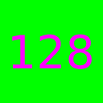
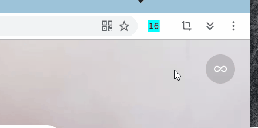
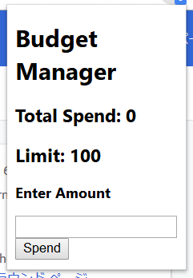

# chrome拡張開発

[TOC]

## I 基礎

このセクションは、拡張の基本的な知識を紹介します。具体的には以下です。

1. プロジェクトのファイルの構成
2. インストール方法
3. 例のHelloWorld

### 1.1 ファイルの構成

 

chromeの拡張を開発する時、四つ種類のファイルは必要だ。

| ファイル種類 | 用途                                                         |
| ------------ | ------------------------------------------------------------ |
| manifest     | 拡張の名、バージョン、ロコ、説明を指定する<br />ポップアップ画面を指定する |
| html         | 拡張の画面                                                   |
| css          | 拡張の画面のスタイル                                         |
| javascrip    | 拡張のロジック                                               |

### 1.2 インストール

1. chromeで「ctrl+alt+X」を押すまたは[chrome://extensions/](chrome://extensions/)を訪問する。
2. 「デベロッパーモード」をオンに設定する。
3. 「パッケージ化されない拡張機能を読み込む」をクリックし、拡張のフォルダを選ぶ。
4. 更新したい場合、直接に「更新」をクリックすると有効になる。でも、manifest.xmlを更新したら、新たに読み込むのは必要です。


### 1.3 HelloWorld

#### 1.3.1 機能

拡張のアイコンをクリックすると、小さいページをポップアップする。ページでのインプットボックスに何か入力すると、ページの内容も入力によって変わる。

#### 1.3.2 ファイル

プロジェクトフォルダに８つのファイルあります。

```sh
G:\ONEDRIVE\文档\CHROME拡張\HELLOWORLD
    icon16.png
    icon48.png
    icon128.png
    jquery-3.4.1.min.js
    manifest.json
    popup.html
    popup.js
    style.css
```

* jquery-3.4.1.min.js 

  JavaScriptライブラリ。ダウンロード：https://code.jquery.com/jquery-3.4.1.min.js

* icon16.png 

* icon48.png 

* icon128.png 

> 128x128 icon　Chrome Web Store
> 48x48 icon　extensions management page (chrome://extensions)
> 16x16 icon　favicon for an extension's pages.
> 参考：https://developer.chrome.com/extensions/manifest/icons

* manifest.json　拡張の基本情報。参考：https://developer.chrome.com/extensions/manifest

```json
{
    "manifest_version": 2,
    "name": "Hello World",
    "version": "1.0",
    "description": "A hello world extension!",
    "icons":{
        "128": "icon128.png",
        "48": "icon48.png",
        "16": "icon16.png"
    },
    "browser_action":{
        "default_icon": "icon16.png",
        "default_popup": "popup.html"
    }
}
```

* popup.html　ポップアップパージ

```html
<!DOCTYPE html>
<html>
    <head>
        <title>Hello World</title>
        <script src="jquery-3.4.1.min.js"></script>
        <script src="popup.js"></script>
        <link rel="stylesheet" type="text/css" href="style.css"/>
    </head>
    <body>
        <h2 id="greet">Hello World</h2>
        <input type='text' id='name'/>
    </body>
</html>
```

* popup.js

```js
$(function(){
    $('#name').keyup(
        function(){
            $('#greet').text('Hello '+$('#name').val());
        }
    )
  }
)
```

* style.css

```css
h2{
    color:orange;
}
```

#### 1.3.3 結果



## II 基本操作

このセクションは、例の拡張の実装を通して、よく使われるchrome APIを紹介する。具体的には以下です。

* データの読み込みと書き込み
* お知らせ
* 右クリックメニュー
* バッジ

### 2.1 目標

目標の拡張は「BudgetManager」という数字を記録するものです。以下の機能が含まれいる。

1. Total Spendの保存と表示、入力数字をTotal Spendに加える
2. オプションページでTotal SpendとLimitをセットする
3. Total SpendはLimitを超えたら、お知らせを出す
4. バッジでTotal Spendの値を表示する
5. 任意ページで数字をセレクトして、右クリック通してTotal Spendに加える



### 2.2 実装

まず、基本的なファイルを作る。後はだんだん新機能を追加する

* manifest.json

```json
{
    "manifest_version": 2,
    "name": "Budget Manager",
    "version": "1.0",
    "description": "This extension tracks your overall spendings.",
    "icons": {
        "128":"icon128.png",
        "48": "icon48.png",
        "16": "icon16.png"
    },
    "browser_action": {
        "default_icon": "icon16.png",
        "default_popup": "popup.html"
    }
}
```

* popup.html

```html
<!DOCTYPE html>
<html lang="en">
<head>
	<meta charset="UTF-8">
	<script src='jquery-3.4.1.min.js'></script>
	<title>Budget Manager</title>
</head>
<body>
	<h1>Budget Manager</h1>
	<h2>Total Spend: <span id="total"></span></h2>
	<h2>Limit: <span id="limit"></span></h2>
	<h3>Enter Amount</h3>
	<input type="text" id="amount"/>
	<input type="submit" value="Spend" id="spendAmount"/>
</body>
</html>
```

#### 2.2.1 データの保存と表示

この機能はデータの読み込みと書き込み操作を依頼する。初めは`total`は0にセットして、`limit`は100にセットする。数字を入力して`Spend`をクリックすると、新しい総費用は画面で更新される同時に、ストレージで保存される。

* manifest.jsonにストレージの権限を追加する。参考：https://developer.chrome.com/apps/storage

```json
"permissions": [
    "storage"
]
```

* popup.jsを編集したら、popup.htmlに追加

```js
$(function(){
    chrome.storage.sync.get(['total','limit'],function (budget) {
        // 変数のイニシャライズ 
        if(budget.total == undefined){
            budget.total = 0;
            chrome.storage.sync.set({'total': 0},function(){});            
        }
        if(budget.limit ==  undefined){
            budget.limit = 100;
            chrome.storage.sync.set({'limit': 100},function(){});            
        }
        // 画面で表示する
        $('#total').text(budget.total);
        $('#limit').text(budget.limit);
    })
    //　ボタンのクリック事件
    $('#spendAmount').click(function(){
        chrome.storage.sync.get(['total','limit'], function(budget){
            var newTotal = 0;
            if(budget.total){
                newTotal += parseInt(budget.total);
            }
            var amount = $('#amount').val();
            if(amount){
                newTotal += parseInt(amount);
            }
            // 新しい値を更新する
            chrome.storage.sync.set({'total':newTotal},function(){});
            $('#total').text(newTotal);
            $('#amount').val('');
        })
    })
});
```

```html
<!-- popup.htmlのheadタッグに追加 -->
<script src='popup.js'></script>
```

#### 2.2.2 オプションページでtotalとlimitをセットする

拡張のアイコンをクリックすると、`オプション`という項目が見える。この項目を有効させるなめ、options.html、options.jsの作成とmanifest.jsonの更新は必要です。

* options.html

```html
<!DOCTYPE html>
<html lang="en">
	<head>
		<meta charset="UTF-8">
		<title>Budget Manager Options</title>
		<script src="jquery-3.4.1.min.js"></script>
		<script src="options.js"></script>
	</head>
	<body>
		<h1>Budget Manager Options</h1>
		<h2>Limit: <input type="text" id="limit" ></h2>
		<input type="submit" id="saveLimit" value="Save Limit"/>
		<input type="submit" id="resetTotal" value="Reset Total"/>
	</body>
</html>
```

* option.jsにtotalとlimitをセットする

```js
$(function(){
    chrome.storage.sync.get('limit',function(budget){
        $('#limit').val(budget.limit);
    })
    $('#saveLimit').click(function () {
        // limitを入力数字にセット
        var limit = $('#limit').val();
        if(limit){
            chrome.storage.sync.set({'limit':limit},function(){
                close();
            })
        }
    })
    $('#resetTotal').click(function() {
        // totalを0にセット
        chrome.storage.sync.set({'total':0},function(){});
    })
})
```

* manifest.jsonにオプションページを指定する

```json
"options_page":"options.html"
```

#### 2.2.3 Total SpendはLimitを超えたら、お知らせを出す

* manifest.xmlの権限を更新する

```json
"permissions": [
    "storage",
    "notifications",
    "contextMenus"
]
```

* popup.jsにロジックを追加する。`total`を更新した時、`limit`と比べる。超えたら、お知らせを出す。

```js
// 新しい値を更新する
chrome.storage.sync.set({'total':newTotal},function(){
    if(amount && newTotal >= budget.limit){
        var limitInfoOptions = {
            type: 'basic',
            iconUrl:'icon48.png',
            title: 'Limit reached',
            message: "Uh on! Looks like you've reached you limit!"
        }
        chrome.notifications.create('limitInfo', limitInfoOptions);
    }
});
```

#### 2.2.4 ページで数字をセレクトして、右クリック通してTotal Spendに加える

manifest.jsonに右クリックの権限と対応のjsファイルを追加する。

```json
"background":{
    "scripts": ["eventPage.js"],
    "persistent": false
},
"permissions": [
    "contextMenus"
]
```
eventPage.js
```js
// アイテムの定義
var contextMenuItem = {
    "id": "spendMoney",
    "title": "SpendMoney",
    "contexts": ["selection"]
};

// メニューでアイテムを表示
chrome.contextMenus.removeAll(function() {
  chrome.contextMenus.create(contextMenuItem);
});

function isInt(value){
    return !isNaN(value) 
            && parseInt(Number(value)) == value
            && !isNaN(parseInt(value, 10));
}

// 右クリックすると、このファンクションが始まる
chrome.contextMenus.onClicked.addListener(function (clickData) {
    if(clickData.menuItemId == "spendMoney" && clickData.selectionText){
        if(isInt(clickData.selectionText)){
            chrome.storage.sync.get(['total','limit'],function(budget){
                var newTotal = 0;
                if (budget.total){
                    newTotal += parseInt(budget.total);
                }
                newTotal += parseInt(clickData.selectionText);
                // 保存する時、お知らせの出し
                chrome.storage.sync.set({'total':newTotal},function(){
                    if(newTotal >= budget.limit){
                        var limitInfoOptions = {
                            type: 'basic',
                            iconUrl:'icon48.png',
                            title: 'Limit reached',
                            message: "Uh on! Looks like you've reached you limit!"
                        }
                        chrome.notifications.create('limitInfo', limitInfoOptions);
                    }
                });
            });
        }
    }
});
```

#### 2.2.5 バッジでTotal Spendの値を表示する

eventPage.js

```js
chrome.storage.onChanged.addListener(function(changes,namespace){
    chrome.storage.sync.get(['total'],function(budget){
        chrome.browserAction.setBadgeText({'text':String(budget.total)});
    });
})
```